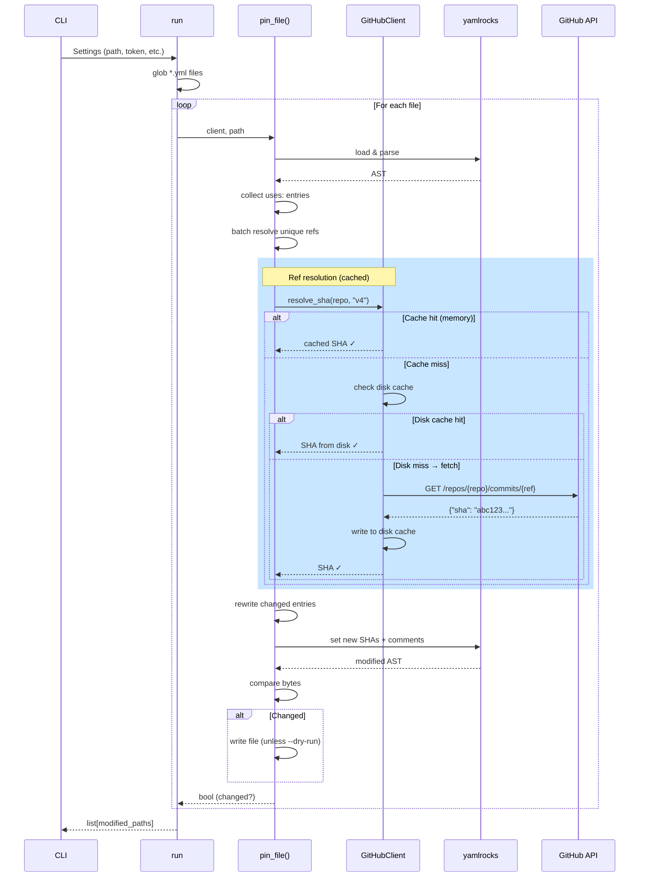
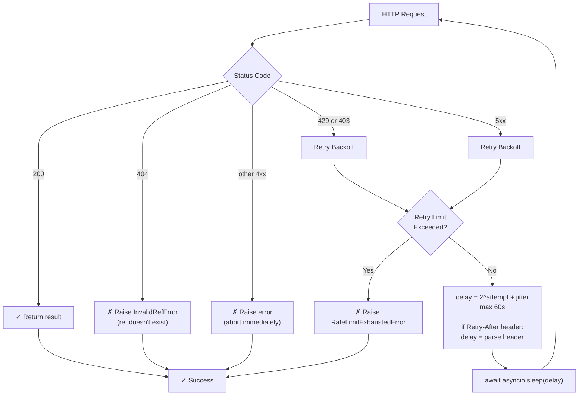

# Architecture Overview

`pin-actions` combines async I/O, thread-safe caching, intelligent rate-limiting, and round-trip YAML editing to process workflows efficiently while preserving comments and formatting.

## High-Level Flow



## Entry Points

- **CLI**: `pin_actions.core.main()` — parses CLI args, calls `run()`
- **Library**: `pin_actions.run()` — orchestrator; processes all files
- **Per-file**: `pin_actions.pin_file()` — single workflow/action file
- **Direct client**: `GitHubClient.resolve_sha()` — resolve one ref

## YAML Round-Trip Editing

`pin_file()` uses `yamlrocks` (Rust-backed, preserves comments/formatting):

```python
doc = yamlrocks.loads(content, option=yamlrocks.OPT_ROUND_TRIP)

# Find all "uses:" paths
for path, value in doc.walk():
    if path and path[-1] == "uses" and isinstance(value, str):
        # Process, resolve, rewrite

# Rewrite: write to AST only as unbroken indexing chain
doc[...][...][...] = new_sha
doc.locate(path).comment = tag

# Serialize: only mutated nodes rewritten, everything else preserved
new_content = doc.to_yaml()
```

## Concurrency model

### Async/await foundation

- `run()` orchestrates all file processing as async tasks
- `pin_file()` performs file I/O and parsing (sync, CPU-bound)
- `GitHubClient.resolve_sha()` and `list_tags()` are async for API calls (I/O-bound)

### HTTP connection pooling

`GitHubClient` maintains a single `httpx2.AsyncClient` (lazily initialized) across all requests:

```python
client = await self._get_http_client()  # reused across all calls
# → connection pooling, TCP keep-alive, performance boost
```

Use `async with GitHubClient(...) as client:` for deterministic cleanup.

### Rate limiting via semaphore

```python
_semaphore = asyncio.Semaphore(concurrency)
async with self._semaphore:
    # GitHub API request
```

- Default concurrency: 5 concurrent requests
- Prevents 429 Too Many Requests errors
- All requests wait if semaphore is at capacity

### Rate-limit backoff decision tree



**Exponential backoff formula:**
```
delay = 2^attempt + random(0, 1)  # capped at 60s
```

With `Retry-After` header, GitHub's advised delay is respected.

**Retry limit:** `max_retries` (default 5)

### In-memory LRU cache

Caches are safe under asyncio's single-threaded cooperative scheduling (no `threading.Lock` needed; critical sections contain no `await`):

```python
_cache: OrderedDict[(repo, ref), sha]
_tags_cache: OrderedDict[repo, tags]
_commit_date_cache: OrderedDict[(repo, sha), date]
```

**Pattern:** in-memory cache → fetch (semaphore-gated) → write-through cache

**LRU eviction:** `OrderedDict` + `move_to_end()` on hit; auto-evict oldest when `len(cache) > max_cache_size` (default 1000).

### Performance

| Scenario | Time |
|----------|------|
| Single workflow, 5 actions, cached | ~100ms |
| 10 workflows, 50 unique actions, cold | ~2-5s |
| Same 10 workflows again, warm cache | ~10-50ms |
| Batch with 429 retry | ~60s worst-case |

## See Also

- [Design Decisions](design-decisions.md) — Why these choices
- [Reference: client](../reference/client.md) — `GitHubClient` API
