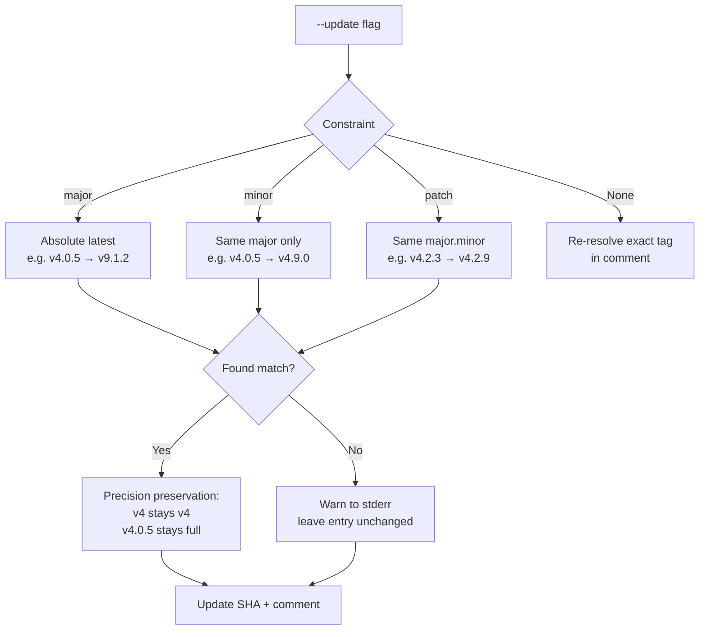
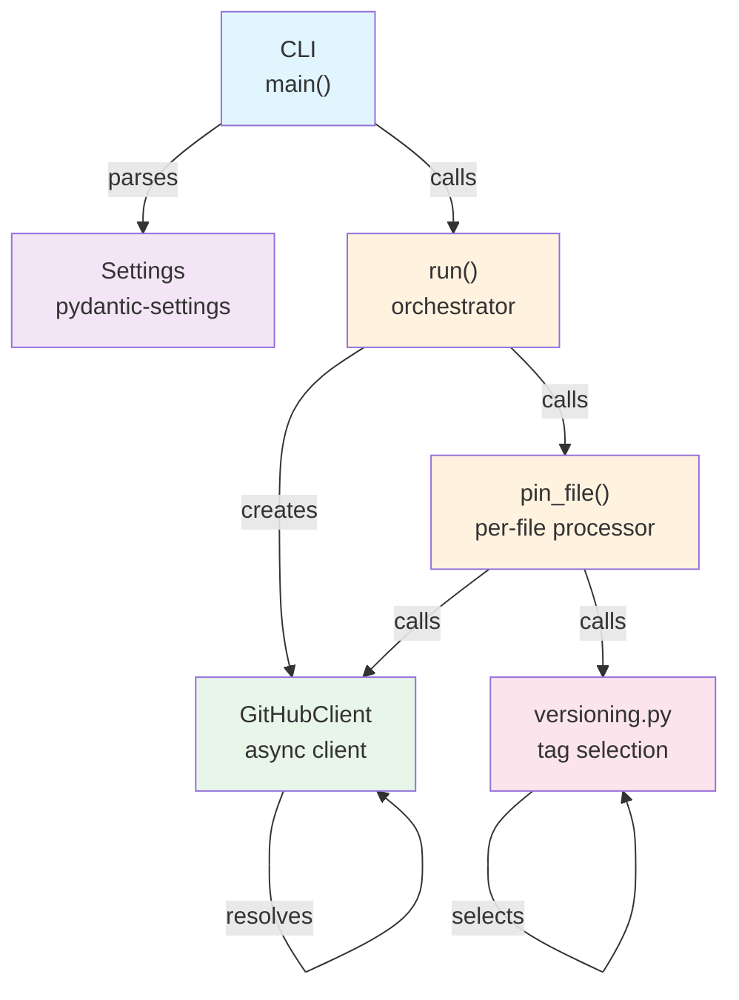

# Design Decisions

Key architectural choices and their rationale.

## Core Decisions

| Decision                                | Rationale                                                                                           |
| --------------------------------------- | --------------------------------------------------------------------------------------------------- |
| **httpx2** (not httpx)                  | `httpx` has stalled since late 2024; httpx2 is a drop-in replacement fork by Pydantic Services Inc. |
| **yamlrocks** (not regex/ruamel.yaml)   | Rust-backed AST preserves comments/formatting; faster than pure Python                              |
| **In-memory LRU cache**                 | Simple & fast, asyncio single-threaded model needs no locks.                                        |
| **Semaphore** (not global rate limiter) | Async-native; respects GitHub API concurrency limits without blocking                               |
| **Batch ref resolution**                | Deduplicate refs before API calls; faster for workflows with repeated actions                       |
| **Raise, don't catch**                  | Library functions raise exceptions; CLI is the only layer that catches and converts to stderr       |

## Versioning & Tag Selection

### Precision Preservation

The rewritten tag matches the original's precision:

| Original | Latest Tag | Result                         |
| -------- | ---------- | ------------------------------ |
| `v4`     | `v4.9.0`   | `v4` (major-only preserved)    |
| `v4.0.5` | `v9.1.2`   | `v9.1.2` (full precision kept) |
| `v4.0`   | `v4.9.3`   | `v4.9` (major.minor preserved) |

Use `--full-version` to use the full precision of the winning tag instead.

### Branch ref handling

Branch refs (e.g., `main`) never parse as a version, so a version constraint (`--update`) never applies to them.
They're re-resolved against the branch name every run, exactly like the default (no-constraint) path —
independent of whichever `--update` mode is active.

### No-Match Warning

If no tag satisfies the constraint, pin-actions warns and leaves the entry untouched — safer than raising
(would abort) or silently no-op'ing (user wouldn't know).

## Already-Pinned Refs

A SHA with a trailing comment (`repo@sha # tag`) is re-resolved on every run:

- If the tag has moved → rewrite SHA
- If the tag hasn't moved → no-op
- A bare SHA with no comment is left untouched (nothing to re-resolve against)

## with.ref Pinning (Checkout)

`pin-actions` **only** pins `with.ref` when:

- The step uses `actions/checkout`
- **Both** `with.repository` and `with.ref` are present
- The action's `uses` value starts with `actions/checkout`

Steps without a `with.repository` sibling are skipped (current-repo context unavailable).

## Cool-off Period (--exclude-newer)

Newly published tags carry unmitigated supply-chain risk:
zero-day or 1-day compromises live until security tooling detects them.
The `--exclude-newer` flag (RFC 3339 / ISO 8601 / friendly duration) implements a minimum-release-age cool-off period,
matching npm (`minimumReleaseAge`), pnpm, and Renovate.

| Scope                                                | Behavior                                                                                                         |
| ---------------------------------------------------- | ---------------------------------------------------------------------------------------------------------------- |
| **Auto-select only** (`--update`)                    | Applied only when picking the latest tag (best candidate first, skip those too new)                              |
| **Exact ref re-resolution** (default, no `--update`) | Not applied; user-named tags are not auto-selected, so risk semantics differ                                     |
| **Zero-cost when disabled**                          | `exclude_newer=None` short-circuits before any commit-date API call                                              |
| **Failure handling**                                 | If commit-date fetch fails, candidate is skipped with warning; if all candidates are too new, pin left unchanged |

When set, candidates are tested best-first (highest version wins).
Only tags passing the age check are considered; if none do, a stderr warning is issued and the pin is left as-is —
same graceful degradation as "no matching version constraint" case.

## Safety Invariants

1. **Stable no-op**: Running twice with unmoved tags produces identical output
    (re-resolution happens, but file only rewritten if SHA differs)
2. **Already-pinned refs are re-resolved, not frozen**: A `sha # tag` is re-resolved on every run;
    a bare SHA is left untouched
3. **No modification of local actions**: `./...` actions skipped entirely
4. **Cache consistency**: Atomic dict ops under cooperative asyncio scheduling (no `await` inside critical sections)
5. **Retry limits**: Max `max_retries` attempts per-ref
6. **Version constraints never silently drop**: Entry left exactly as-is with stderr warning
7. **Branch refs are always re-resolved**: A version constraint (`--update`) only affects semver-parseable comments;
    a branch-name comment always falls through to the default re-resolve path, regardless of `--update`

## Error Handling Strategy

Contract: **library raises, caller handles**.
No function prints-and-continues or returns a sentinel.

- `pin_file()` raises on YAML parse errors, invalid refs, rate limits, network errors
- `run()` collects per-file exceptions into `ExceptionGroup` rather than aborting mid-batch
- CLI (`main()`) is the only catch point; converts exceptions to stderr + exit code

## Component Relationships

## See Also

- [Architecture Overview](architecture.md) — System design and concurrency model
- [Reference: versioning](../reference/versioning.md) — Tag selection API
