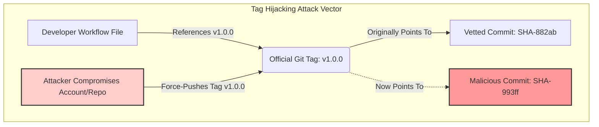
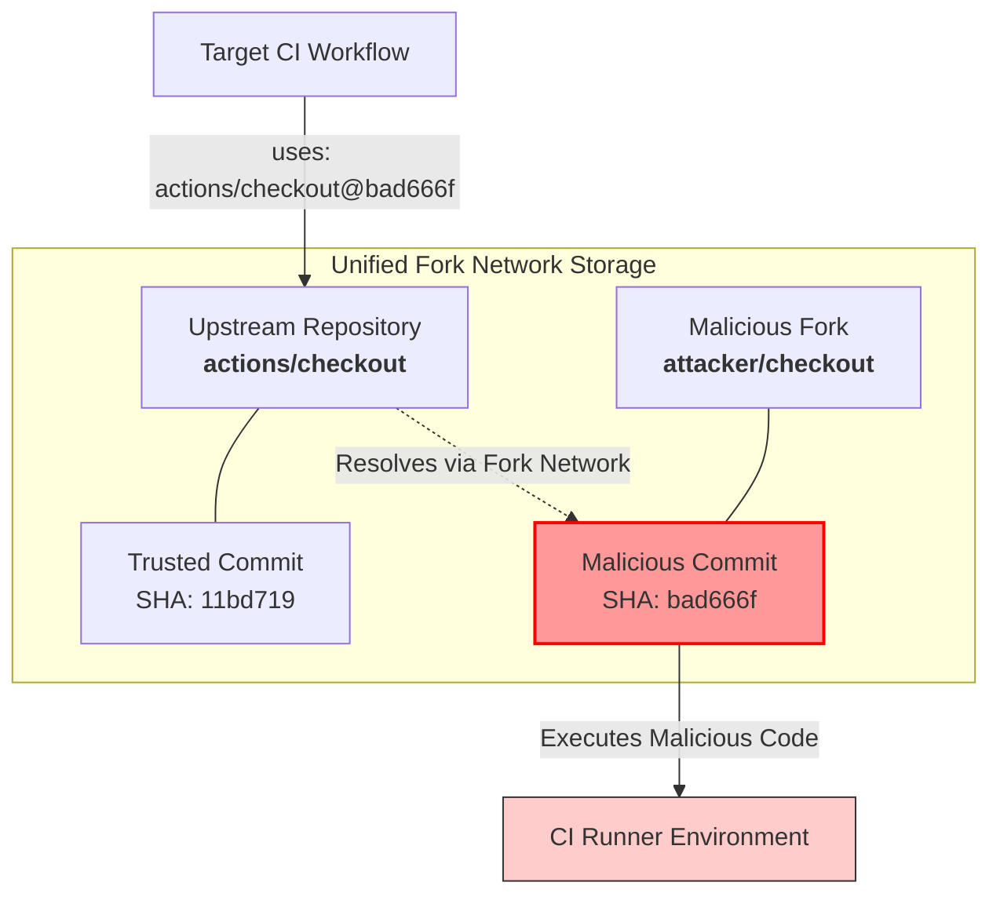
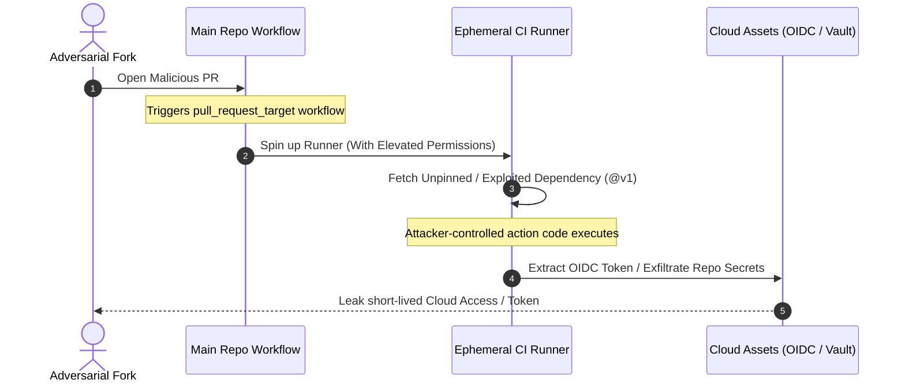

# Threat Model & Architectural Security Analysis: Pinning GitHub Actions

## 1. Executive Summary

Modern CI/CD pipelines are prime targets for software supply chain attacks. In GitHub Actions, referencing dependencies via **mutable Git tags** (e.g., `@v4`) introduces severe operational and security vectors. This document details the architectural threats of unpinned actions, analyzes exploitation vectors—including the complex GitHub Fork Network vulnerabilities—and establishes an immutable defense blueprint for security architects and systems engineers.

---

## 2. The Core Threat: Mutable vs. Immutable References

### 2.1 The Git Tag Illusion

Git tags are pointers to specific commit hashes, but they are **mutable**. A repository owner, or an attacker who compromises the owner's account, can force-push an existing tag to point to a completely different, malicious commit.



### 2.2 Pinning to Full-Length Commit SHA

Pinning to a **40-character commit SHA** transforms the action reference into an **immutable** contract. Because Git hashes are cryptographic checksums of the repository state at that exact point in time, the code cannot be altered without altering the hash itself.

---

## 3. Advanced Threat Vectors & Architectural Blind Spots

### 3.1 GitHub Fork Network Vulnerabilities (Imposter Commits)

GitHub uses a shared object storage optimization across the **Fork Network**. When a repository is forked, the upstream repository and all its downstream forks share the same underlying pool of Git objects.



- **The Exploit**: An attacker forks a popular action, commits malicious code to their fork, and acquires a valid SHA. Because of the unified network storage, **the upstream repository can resolve and fetch that malicious SHA**, even if it was never merged into the upstream project.
- **The Risk**: A reviewer scanning a workflow file might see `uses: actions/checkout@bad666f`. Because the domain path explicitly says `actions/checkout`, they may assume it is safe. However, GitHub will resolve `bad666f` from the fork network, executing code entirely written by the adversary.

### 3.2 Forked PR Exploitation via Dangerous Triggers (`pull_request_target`)

The `pull_request_target` trigger runs in the context of the base repository's main branch, giving it access to write tokens and repository secrets.



If your workflow relies on an unpinned action or is manipulated to execute a tag-hijacked dependency during a `pull_request_target` run, the attacker gains immediate runtime control over a highly privileged runner environment.

### 3.3 The Docker Action Escape Hatch

Many systems engineers do not realize that pinning a GitHub Action does not inherently pin its underlying dependencies. If an action's configuration (`action.yml`) specifies a Docker container using a mutable tag:

```yaml
# Inside a pinned third-party action's action.yml
runs:
  using: 'docker'
  image: 'node:latest' # ❌ BREAKS IMMUTABILITY
```

Even if you pin the top-level repository SHA, a rebuild of that action can pull a compromised or updated base image, silently bypassing your workflow pins.

---

## 4. Mitigation Matrix & Defense Blueprint

| Mitigation Level | Strategy                      | Implementation Detail                                                                       | Target Vector                         |
| :--------------- | :---------------------------- | :------------------------------------------------------------------------------------------ | :------------------------------------ |
| **Layer 1**      | SHA Pinning with Inline Tags  | Replace tags with full 40-character SHAs. Append human-readable version annotations.        | Tag Hijacking, Supply Chain Injection |
| **Layer 2**      | Token Least Privilege         | Set default workflow permissions explicitly to `permissions: read-all` or `contents: read`. | OIDC Theft, Privilege Escalation      |
| **Layer 3**      | Automated Dependency Upgrades | Deploy Dependabot or Renovate with config pinned to fetch SHAs instead of tags.             | Technical Debt, Outdated Code         |
| **Layer 4**      | Static Analysis / Linters     | Implement **Zizmor** or **Actionlint** in pre-commit hooks to block unpinned actions.       | Human Error, Blind Spots              |

### 4.1 Secure YAML Example

```yaml
name: Secure Production Pipeline
on:
  push:
    branches: [ main ]

permissions: # Layer 2: Explicit Least Privilege
  contents: read
  id-token: write # Only granted if strictly required for OIDC

jobs:
  build:
    runs-on: ubuntu-latest
    steps:
      # Layer 1: Pinned to full commit SHA with version comment
      - name: Checkout Code
        uses: actions/checkout@11bd71901bbe5b1630ceea73d27597364c9af683 # v4.2.2

      - name: Run Vetted Verification Step
        uses: third-party/secure-action@d41d8cd98f00b204e9800998ecf8427e # v1.0.3
```

---

## 5. Compliance & Engineering Benefits

1. **CI/CD Immutability**: Guarantees identical execution parameters across all branches and deployments. Eliminates "it worked yesterday" debugging sessions caused by unannounced minor releases.
2. **OpenSSF Scorecard Compliance**: Pinning actions directly elevates your project's OpenSSF Supply Chain security score, satisfying strict regulatory frameworks and enterprise vendor audits.
3. **Minimized Blast Radius**: In tandem with explicit `permissions` blocks, SHA pinning blocks attackers from compromising external components to query cloud APIs, steal OIDC tokens, or exfiltrate private source code.

---

## 6. How `pin-actions` Addresses This Threat Model

This project directly implements the mitigation layers described above:

| Mitigation Layer                            | `pin-actions` Feature                                                                                                                                                                                                                                                                                         |
| :------------------------------------------ | :------------------------------------------------------------------------------------------------------------------------------------------------------------------------------------------------------------------------------------------------------------------------------------------------------------ |
| **Layer 1** (SHA pinning with inline tags)  | Core function: `pin_file()` / `run()` resolve mutable `uses:` refs to full 40-character SHAs with a version comment (see [Architecture](architecture.md))                                                                                                                                                     |
| **Layer 3** (Automated dependency upgrades) | `--update major/minor/patch` re-resolves pinned tags forward within a version constraint; `--exclude-newer` adds a cool-off period against same-day supply-chain attacks (§3.1/§3.2 above)                                                                                                                    |
| **Layer 4** (Static analysis / linters)     | This repository dogfoods `zizmor` and `actionlint` in `.pre-commit-config.yaml` and CI                                                                                                                                                                                                                        |
| **§3.3 Docker escape hatch**                | `--image-pin` (via `pin_actions.registry.ContainerRegistryClient`) resolves `docker://` steps and `container.image`/`services[*].image` tags to immutable `sha256:` content digests — closing the exact gap described in §3.3, where SHA-pinning the action itself doesn't pin its underlying container image |

Not addressed by this tool (out of scope, mitigate separately):

- **§3.1/§3.2 Fork-network imposter commits & `pull_request_target`**: pinning a SHA doesn't verify *provenance* of that SHA — a malicious fork's commit is just as pinnable as an upstream one. Mitigate with manual code review of any new SHA a PR introduces, and avoid granting `pull_request_target` write-level secrets to untrusted contributors.
- **Layer 2 (token least privilege)**: `permissions:` blocks are a workflow-authoring concern; `zizmor`'s `excessive-permissions` audit (enabled in this repo) catches over-broad grants.

## See Also

- [Architecture Overview](architecture.md) — How resolution/pinning is implemented
- [Design Decisions](design-decisions.md) — Why these choices
